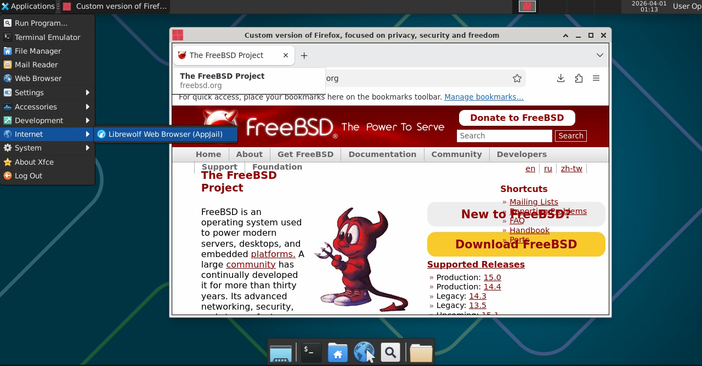
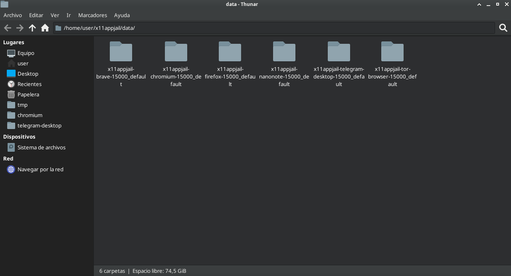
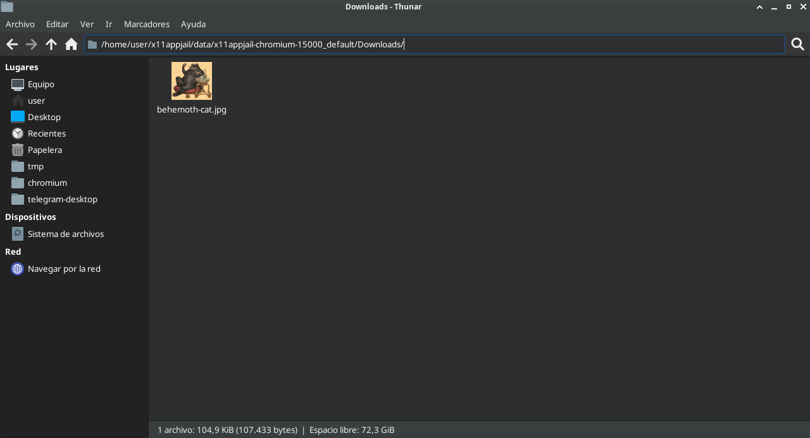
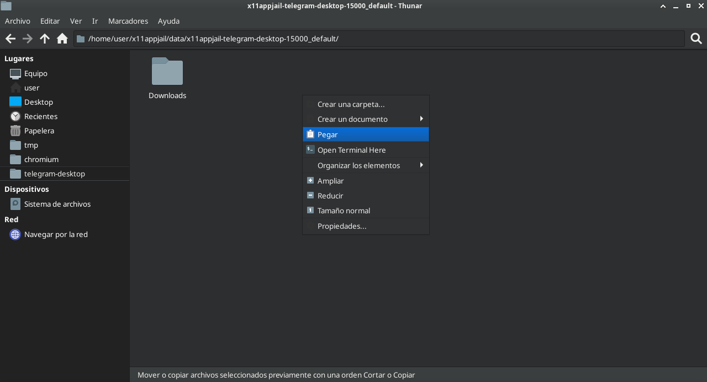
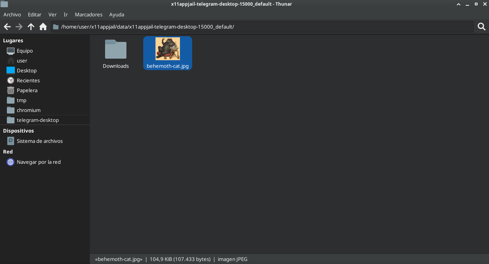

# x11appjail: x11 applications already sandboxed by AppJail

<p align="center">
    
</p>

OS-level virtualization is not as perfect as hardware-level virtualization. Containers run the same kernel as the host, and in most cases, if an application needs a file, a directory, or a device, these resources must be shared; therefore, this trade-off must be accepted. A vulnerability in a device (`/dev`), even if the application is running inside the container as a non-root user, could pose a risk to the host. However, all of this applies in the same way as if an application were running from the host, and even worse, since the application has more privileges. However, when implemented correctly, a containerized application is far superior, in terms of isolation, to one running from the host. You can, for example, limit the scope of devices in `/dev`, restrict the connections an application can establish, set resource limits, isolate the filesystem and processes, and much more; all in a compartmentalized manner. This means that if you want to run a web browser in a container, the fact that one is compromised does not imply that another container running your email client is at the same risk.

In FreeBSD, OS-level virtualization is implemented using jails, but most users prefer to use a jail manager. In our case, we use AppJail from this repository because of its flexibility and because it can safely run X11 applications thanks to `appjail-x11(1)`. See [Sandboxed x11 applications on AppJail Handbook](https://appjail.readthedocs.io/en/latest/x11/#sandboxed-x11-applications) for details.

---

Table of Contents
=================

* [x11appjail: x11 applications already sandboxed by AppJail](#x11appjail-x11-applications-already-sandboxed-by-appjail)
* [Table of Contents](#table-of-contents)
   * [Prerequisites](#prerequisites)
      * [AppJail configuration](#appjail-configuration)
      * [Privileges](#privileges)
         * [Privileges for AppJail](#privileges-for-appjail)
         * [Privileges for pkg(8)](#privileges-for-pkg8)
   * [How to use this repository](#how-to-use-this-repository)
      * [Environment](#environment)
      * [Ephemeral Jails](#ephemeral-jails)
      * [Developing a new AppScript](#developing-a-new-appscript)
      * [App Configuration](#app-configuration)
      * [Scripts](#scripts)
   * [Sandboxed Applications](#sandboxed-applications)
   * [Tips &amp;&amp; Tricks](#tips--tricks)
      * [Using a command-line snippet manager](#using-a-command-line-snippet-manager)
      * [Keyboard Layout](#keyboard-layout)
      * [Changing escape key](#changing-escape-key)
      * [Closing an application](#closing-an-application)
      * [Icons and Cache (in XFCE)](#icons-and-cache-in-xfce)
      * [Sharing files between jails](#sharing-files-between-jails)
      * [Clipboard](#clipboard)
         * [Analyzing the clipboard for malicious or misleading unicode characters](#analyzing-the-clipboard-for-malicious-or-misleading-unicode-characters)
         * [Transferring a file](#transferring-a-file)
         * [Synchronizing the clipboard between two X servers](#synchronizing-the-clipboard-between-two-x-servers)
   * [Demo](#demo)

## Prerequisites

### AppJail configuration

These scripts are designed so that users don't have to do much to get started, but at the very least, before running it, you should have preconfigured the parameters related to ZFS (if you use it) and, as a recommendation, `EXT_IF`. See `appjail.conf(5)` and the [ZFS on AppJail Handbook](https://appjail.readthedocs.io/en/latest/ZFS/) for more details.

### Privileges

#### Privileges for AppJail

AppJail requires privileges to run, but it can be integrated with tools such as [security/doas](https://freshports.org/security/doas) to run it as a user without root privileges. This is recommended when you are the only person using the computer and have privileges, or in cases where there are more than two sysadmins or developers on the same server with root access.

**/usr/local/etc/doas.conf**:

```
permit nopass keepenv :appjail as root cmd appjail
```

This rule also assumes that you have a group named appjail. If you don't, don't worry:

```
pw groupadd -n appjail
```

To add your user to the `appjail` group simply run the following:

```
pw groupmod -n appjail -m "$USER"
```

Where `$USER` is your user. For these changes to take effect, you must log back into the system if you are adding yourself.

To test the changes above, simply run the following as a non-root user:

```
appjail help
```

See also: [Trusted Users on AppJail Handbook](https://appjail.readthedocs.io/en/latest/trusted-users/).

#### Privileges for pkg(8)

These AppScripts will check whether the dependencies are available on your system and, if not, install them. This requires privileges, so let’s configure `doas.conf(5)` based on what we’ve done previously.

```
permit nopass :appjail as root cmd pkg
```

The dependencies that will be installed:

* `appjail`
* `su-exec`
* `xauth`
* `xdotool`
* `xev`
* `xephyr`
* `xseticon`
* `git-tiny`
* `debootstrap` (LinuxJails-only)

## How to use this repository

[AppScript](https://freshports.org/archivers/appscript) is used to package each application into its own executable. You can run these AppScripts in a portable manner or install them. Note that if you choose to run an AppScript without installing it, environment variables are not preserved, which means you must define each environment variable before running the AppScript. If you choose to install an AppScript, only environment variables prefixed with `X11APPJAIL_` and defined before running the AppScript are preserved, and the user can override them simply by defining them before running the installed AppScript.

You can run an application from this repository by cloning it and executing the `./<APP>/APPSCRIPT` script, which is simply a POSIX shell script. Note that you cannot install an application this way.

```sh
git clone https://github.com/DtxdF/x11appjail.git
cd ./x11appjail/
./<APP>/APPSCRIPT
```

However, the best approach is to create an AppScript. To create an AppScript, this repository contains a Makefile that automates this step.

```
make build APP=<APP>
# or to build everything:
make build-all
```

If you don't feel like building AppScripts or don't want to clone this repository, assets are automatically created by each release. Regardless of the path you choose, all AppScripts run in the same way: like any other executable file.

### Environment

All AppScripts support the following environment variables:

* `X11APPJAIL_JAIL`: Environment variable used by some scripts. This environment variable is always set by each AppScript and cannot be modified. The syntax used by these AppScripts is `x11appjail-<APPNAME>-<UID>_${X11APPJAIL_PROFILE}`, where `<APPNAME>` is a hardcoded name set by each AppScript in its own `app.conf` and `<UID>` is determined based on `id -u`.
* `X11APPJAIL_PROFILE` (default: `default`): AppScripts will attempt to reuse the jail, and the jail name is based on this parameter. This parameter is used to create multiple instances of the same application. The cache and data are not shared with other instances. This is useful for isolating tasks within each jail.
* `X11APPJAIL_LOCKDIR` (default: `${HOME}/x11appjail/locks/${X11APPJAIL_JAIL}`): Location of locks to prevent race conditions and unwanted effects in some operations.
* `X11APPJAIL_APPDIR` (default: `${HOME}/x11appjail/apps/${X11APPJAIL_JAIL}`): Directory used by installed AppScripts. Two scripts are created: `START` and `APPSCRIPT`. `START` is simply a wrapper for `APPSCRIPT` that preserves the environment variables used during AppScript installation. `APPSCRIPT` is a copy of the executed AppScript. When `START` is executed, this script will honor all environment variables passed to it, even if they are already defined.
* `X11APPJAIL_DATADIR` (default: `${HOME}/x11appjail/data/${JAIL}`): The data that must persist. The owner and group of each file will match those of the user running the AppScript.
* `X11APPJAIL_CACHEDIR` (default: `${HOME}/x11appjail/cache/${JAIL}`): Another directory that the jail uses to cache data, so that recreation is faster.
* `X11APPJAIL_OSVERSION` (optional): Configure the `osversion` parameter of `appjail-quick(1)`. By default, this value is calculated based on the kernel version. Note that this AppScript will create the release directory using distfiles if your host has a kernel version lower than `1500000`; otherwise, `pkgbase(8)` will be used. This parameter affects the release created by `appjail-fetch(1)`. Ignored when the AppScript installs a LinuxJail.
* `X11APPJAIL_VIRTUALNET` (optional): When set, instead of inheriting the host's network stack, a virtual network specified by this environment variable is used. This requires you to configure a few more things, if you haven't already. See [Packet Filter on AppJail Handbook](https://appjail.readthedocs.io/en/latest/networking/packet-filter/). Ignored when the AppScript installs a LinuxJail.
* `X11APPJAIL_INSTALL` (optional): If set (to any value such as `1`), the AppScript will only install itself and the .desktop file within `~/.local/share/applications`. The icon is installed separately, but this depends on the specific application. The .desktop file isn't included in the AppScript; instead, it is copied directly from the jail and modified. The `Exec` entry is modified to use the `START` script mentioned earlier, and `Name` is simply suffixed with the string `(AppJail)`.
* `X11APPJAIL_UNINSTALL` (optional): If set, the AppScript will delete any files during the installation phase and stop the jail.
* `X11APPJAIL_LABEL[0-9]+` (optional): Specify `appjail-label(1)` labels to be assigned to the jail. At a minimum, you must start with `X11APPJAIL_LABEL0`.
* `X11APPJAIL_PKG_CONF` (optional): Copy a `pkg.conf(5)` from the host as `/usr/local/etc/pkg/repos/FreeBSD.conf` inside the jail. Ignored when the AppScript installs a LinuxJail.
* `X11APPJAIL_EXEC_TOOL` (default: `doas`): Tool for elevating privileges in order to install dependencies.
* `X11APPJAIL_SHAREDIR` (default: `${HOME}/x11appjail/share/${X11APPJAIL_JAIL}`): Miscellaneous files that the AppScript can use, such as icons.
* `X11APPJAIL_ALLOW_HOST` (optional): Create a cookie after creating the jail and before starting the X server. Useful for clipboard access. See [Sandboxed x11 applications/Clipboard on AppJail Handbook](https://appjail.readthedocs.io/en/latest/x11/#clipboard).
* `X11APPJAIL_WRAPPER` (optional): When this environment variable is set, the user can specify an executable file that the AppScript will run instead of the one specified by the creator. See also `wrapper.sh` script for environment variables used by this script.
* `X11APPJAIL_NO_EPHEMERAL` (optional): By default, unless otherwise specified, all jails are ephemeral. After system startup, the `appjail(1)`'s `rc(8)` script (or you yourself, implicitly when executing the `Exec` entry of the .desktop file) will start the jail, and AppJail will detect that the jail is ephemeral, so it will be removed. AppJail will detect this and recreate the jail. The advantage of this is that you'll get automatic updates, but the downside is that it will initially slow down the jail's startup time depending on your system specs. With this environment variable, you can make your jail permanent.
* `X11APPJAIL_TITLE` (optional): Define a custom title. If none is specified, the app description will be used. Note that the title will be concatenated to the profile name. For example, if you use the profile `default` and the title `foobar`, the resulting title will be `default: foobar`.

In addition to the environment variables mentioned, `USER`, `HOME`, and `XAUTHORITY` can affect the execution of each AppScript. And keep in mind that each AppScript may need or use custom environment variables.

### Ephemeral Jails

Each jail created is set with the `ephemeral` option of `appjail-quick(1)`, which means that when it stops, it is simply destroyed. Don't worry, the volumes are mounted on your host, so any data that needs to persist will be there.

### Developing a new AppScript

### App Configuration

This file is used to define the parameters used by each AppScript and is self-explanatory.

* `APPNAME`
* `APPDESCR`
* `APPBIN`
* `LINUX_VERSION`
* `NO_EPHEMERAL`

### Scripts

These scripts are designed to be as generic as possible, and although they are located in the root tree of this repository, they are symlinks in each AppScript's directory to save space. When an AppScript is created using `make build` (or `make build-all`), they are resolved using `appscript(1)`'s `-L` flag.

* `APPSCRIPT`
* `create.sh`
* `startup.sh`
* `start-server.sh`

In addition to these scripts, there are scripts that can be defined in each application and that only affect the specified application:

* `install.sh` (mandatory): A script that installs any necessary files when `X11APPJAIL_INSTALL` is set. The files that need to be installed include, at a minimum, the .desktop file, preferably copied from the jail to ensure you have the most up-to-date version.
* `uninstall.sh` (mandatory): Delete any files installed during the installation phase.
* `arguments.sh` (optional): Additional arguments passed to `appjail-makejail(1)`. The `set` command of `sh(1)` is used to replace arguments, so you must define each new parameter using the following syntax: `set -- "$@" <new argument>`. After this file is processed, `--puid`, `--pgid` and, depending on `X11APPJAIL_PKG_CONF` environment variable, `--pkg_conf` are passed to the Makejail, so you must end your file with at least `set -- "$@" --`.
* `wrapper.sh` (optional): By default, if no `wrapper.sh` script exists and the `X11APPJAIL_WRAPPER` environment variable isn't specified, the `exec appjail cmd jexec "${X11APPJAIL_JAIL}" -U noroot -e DISPLAY=":${X11APPJAIL_DISPLAY}" "${X11APPJAIL_APPBIN}" "$@"` command is executed. However, you can create a `wrapper.sh` script with the execute bit set within the AppScript's directory to perform actions that the default command does not. The environment variable `X11APPJAIL_DISPLAY` (without the `:` prefix) is set to the display that the process pointed to by the `X11APPJAIL_APPBIN` environment variable should have access to.

## Sandboxed Applications

* [Nanonote](Apps/nanonote/README.md): Minimalist note taking application.
* [LibreWolf](Apps/librewolf/README.md): Custom version of Firefox, focused on privacy, security and freedom.
* [Tor Browser](Apps/tor-browser/README.md): Tor Browser for FreeBSD.
* [Telegram Desktop](Apps/telegram-desktop/README.md): Telegram Desktop messaging app.
* [Chromium](Apps/chromium/README.md): Google web browser based on WebKit.
* [Brave](Apps/brave/README.md): Brave web browser based on WebKit.
* [Firefox](Apps/firefox/README.md): Web browser based on the browser portion of Mozilla.
* [Thunderbird](Apps/thunderbird/README.md): Mozilla Thunderbird is standalone mail and news that stands above.
* [Feh](Apps/feh/README.md): Image viewer that utilizes Imlib2.

## Tips && Tricks

### Using a command-line snippet manager

Keeping track of which environment variables you've used isn't very practical when installing multiple AppScripts, so it's a good idea to use a snippet manager like [deskutils/pet](https://freshports.org/deskutils/pet).

```sh
pkg install -y pet fzf
```

**~/.config/pet/snippet.toml**:

```toml
[[Snippets]]
  Description = "Install LibreWolf in a jail"
  Output = ""
  Tag = ["librewolf"]
  command = "mkdir -p \"${HOME}/AppScripts\" && fetch -qo \"${HOME}/AppScripts/librewolf.appscript\" https://github.com/DtxdF/x11appjail/releases/latest/download/librewolf-amd64.appscript && chmod +x \"${HOME}/AppScripts/librewolf.appscript\" && env X11APPJAIL_INSTALL=1 X11APPJAIL_ALLOW_HOST=1 X11APPJAIL_ENABLE_SOUND=1 \"${HOME}/AppScripts/librewolf.appscript\""
```

So, if you want to update LibreWolf, uninstall it first.

```
X11APPJAIL_UNINSTALL=1 ~/x11appjail/apps/x11appjail-librewolf-`id -u`_default/START
```

And then execute the snippet.

```
pet exec -t librewolf
```

### Keyboard Layout

[x11/setxkbmap](https://freshports.org/x11/setxkbmap) is installed by the Makejails, so you can change the keyboard layout.

At runtime, you can press `C-t :`, and then run `exec setxkbmap <layout>`. And if you want the changes to persist, add that command to your `~/x11appjail/data/<jail>/.ratpoisonrc` file.

If you have allowed the host to access the X server created by `Xephyr(1)` using the `X11APPJAIL_ALLOW_HOST` environment variable, you can also use the host's `setxkbmap(1)` to change the keyboard layout from the host.

### Changing escape key

`ratpoison(1)`'s escape key may conflict with applications such as web browsers, so it's best to change it.

**~/x11appjail/data/`<jail>`/.ratpoisonrc**:

```
escape C-e
```

### Closing an application

Remember that closing `Xephyr(1)`'s window may force your application to close, which may not be desirable. First close the application and then close the window manager. For `ratpoison(1)`, just press `C-t k` to close the current window and then `C-t :` to execute the `quit` command.

### Icons and Cache (in XFCE)

Sometimes, XFCE doesn't display icons correctly in Applications Menu. A simple workaround is to just run `xfce4-panel -r`.

### Sharing files between jails

A compromised jail can inject a backdoor into any file created within it, or the file itself may be malicious; however, sometimes it is necessary to share a file with another jail. There is no specific protocol for this, but there is a much simpler way to accomplish this job: by using a file manager.

```sh
thunar ~/x11appjail/data
```

<p align="center">
    
</p>

<p align="center">
    
</p>

<p align="center">
    
</p>

<p align="center">
    
</p>

**TIP**: Create a bookmark using CTRL-D, and then give it a meaningful name. In my case, for example, Telegram and Chromium, which are apps I use frequently.

### Clipboard

**Note**: The following assumes that your user has the necessary cookies to access the X servers. See `X11APPJAIL_ALLOW_HOST` environment variable.

When working with the clipboard, there are two approaches to consider. The first involves simply reading the clipboard from a single X server, which applies to some applications we'll discuss later. The second involves synchronizing the clipboard between two X servers, which is likely the most common scenario, though also the least secure.

Regardless of which method you choose, you need to know which display server the jailed X11 application uses:

```console
$ appjail jail list -j x11appjail-chromium-15000_default x11_display
X11_DISPLAY
1000
```

#### Analyzing the clipboard for malicious or misleading unicode characters

Using [unicode-show](https://freshports.org/security/py-unicode-show) and [xclip](https://freshports.org/x11/xclip), we can analyze the data to detect potential malicious code, such as this "[trojan](https://github.com/nickboucher/trojan-source/blob/main/Python/commenting-out.py)":

```console
$ xclip -out -selection CLIPBOARD -display :1000 | unicode-show
<stdin>:4: if access_level != 'none[U+202E][U+2066]': # Check if admin [U+2069][U+2066]' and access_level != 'user
   -> '\u202e' (U+202E, RIGHT-TO-LEFT OVERRIDE, Cf)
   -> '\u2066' (U+2066, LEFT-TO-RIGHT ISOLATE, Cf)
   -> '\u2069' (U+2069, POP DIRECTIONAL ISOLATE, Cf)
   -> '\u2066' (U+2066, LEFT-TO-RIGHT ISOLATE, Cf)
<stdin>:5: [missing newline at end]
```

However, this approach has one drawback: you are parsing the clipboard, which is dynamic by nature. Even if it doesn’t contain Unicode characters or the data seems harmless, you shouldn’t assume it will remain that way a second later. You should save the clipboard’s contents to a static file and then analyze it.

```console
$ xclip -out -selection CLIPBOARD -display :1000 | tee static.txt | unicode-show
...
```

#### Transferring a file

To transfer a file, or, more commonly, an image, the application should allow you to do so. And you should consider what your goal is in this case: Do you want to copy an image to the file system? Or do you want to copy an image between two X servers? The first option is like downloading the file, while the second is more useful for copying an image between two X11 applications.

To transfer an image and save it to the file system or use another application to view it, you first need to know the **TARGET**, which usually refers to the file type and then specify the target when downloading the file.

```console
$ xclip -out -selection CLIPBOARD -target TARGETS -display :1000
TIMESTAMP
TARGETS
SAVE_TARGETS
MULTIPLE
text/x-moz-url
chromium/x-internal-source-rfh-token
chromium/x-source-url
image/png
text/html
$ xclip -out -selection CLIPBOARD -target image/png -display :1000 | feh -
```

To transfer a file between two X servers, you can use [xclip](https://freshports.org/sysutils/xclip) again. Both the output and the input must have the **-target** set.

```console
$ xclip -out -selection CLIPBOARD -target image/png -display :1000 |\
    xclip -in -selection CLIPBOARD -target image/png -display :0
```

An easier way is to use [xclipsync](https://freshports.org/sysutils/xclipsync), which automatically detects the **-target** on both sides.

```console
$ xclipsync -O -a :1000 -b :0
```

#### Synchronizing the clipboard between two X servers

Unlike the data transfer described above, synchronization occurs in real time, implicitly, and just like when using X11 applications on the same X server. To do this, you should use a tool like [xclipsync](https://freshports.org/sysutils/xclipsync), which is specifically designed for this purpose.

```console
$ xclipsync -a :1000 -b :1001
```

Regardless of what is copied to `:1000`, when an X11 application on `:1001` requests the contents of the clipboard, the X11 application on `:1000` will transfer the data encoded in UTF-8.

However, this raises a usability issue: although you can easily retrieve the display server for a specific jail using `appjail-jail(1)` `list` (or `get`), this number may change when the jail is recreated. To fix this, you can use the following command:

```console
xclipsync -a :`appjail jail list -Hj x11appjail-telegram-desktop-15000_default x11_display` -b :`appjail jail list -Hj x11appjail-chromium-15000_default x11_display`
```

Although this solves the problem of accessing the display server we don't know, it's even worse, since you have to type more characters. To improve this, append the following to your `~/.profile`:

```sh
xclipsync_host()
{
    local uid jail x11_display
    local app="$1" profile="${2:-default}"

    test -n "${app}" || echo "usage: xclipsync_host <app> [<profile>]" >&2
    test -n "${app}" || return 64 # EX_USAGE

    uid=`id -u`
    jail="x11appjail-${app}-${uid}_${profile}"
    x11_display=`appjail jail list -Hj "${jail}" x11_display` || return $?

    test -n "${x11_display}" || echo "${jail}: No such display" >&2
    test -n "${x11_display}" || return 66 # EX_NOINPUT

    xclipsync -a "${DISPLAY}" -b :"${x11_display}"
}

xclipsync_apps()
{
    local uid
    local jail1 jail2
    local profile1 profile2
    local jail1_x11_display jail2_x11_display
    local app1="$1" app2="$2"

    test -n "${app1}" || echo "usage: xclipsync_apps <app#1>[:<profile>] <app#2>[:<profile>]" >&2
    test -n "${app1}" || return 64 # EX_USAGE
    test -n "${app2}" || xclipsync_apps # EX_USAGE

    profile1=`printf "%s" "${app1}" | cut -s -d: -f2-`
    test -n "${profile1}" || profile1="default"

    profile2=`printf "%s" "${app2}" | cut -s -d: -f2-`
    test -n "${profile2}" || profile2="default"

    uid=`id -u`

    jail1="x11appjail-${app1}-${uid}_${profile1}"
    jail2="x11appjail-${app2}-${uid}_${profile2}"

    jail1_x11_display=`appjail jail list -Hj "${jail1}" x11_display` || return $?
    test -n "${jail1_x11_display}" || echo "${jail1}: No such display" >&2
    test -n "${jail1_x11_display}" || return 66 # EX_NOINPUT

    jail2_x11_display=`appjail jail list -Hj "${jail2}" x11_display` || return $?
    test -n "${jail2_x11_display}" || echo "${jail2}: No such display" >&2
    test -n "${jail2_x11_display}" || return 66 # EX_NOINPUT

    xclipsync -a :"${jail1_x11_display}" -b :"${jail2_x11_display}"
}
```

Reload that file, open a new window in tmux, or reopen the console to load the functions. After that, you can synchronize the clipboard between a jailed X11 application and your host (or wherever `DISPLAY` points) using `xclipsync_host`, and synchronize the clipboard between two jailed X11 applications using `xclipsync_apps`. Note that while `xclipsync(1)` supports more selections (such as `PRIMARY` or `SECONDARY`), we use the default, `CLIPBOARD`, which is the most common.

**Synchronizing the host and a jailed X11 application**:

```console
$ xclipsync_host chromium
```

**Synchronizing two jailed X11 applications**:

```console
$ xclipsync_apps telegram-desktop chromium
```

## Demo

In these videos, [Overlord](https://github.com/DtxdF/overlord) is used to create a pristine VM to demostrate how Brave will be executed using its AppScript.

https://github.com/user-attachments/assets/c60b3f22-5e91-45a6-9be7-ea7397d202e9

https://github.com/user-attachments/assets/f91cbf4a-54a1-4df8-95fe-c02942e96879

https://github.com/user-attachments/assets/da38f509-c848-40af-97e6-515801251618
